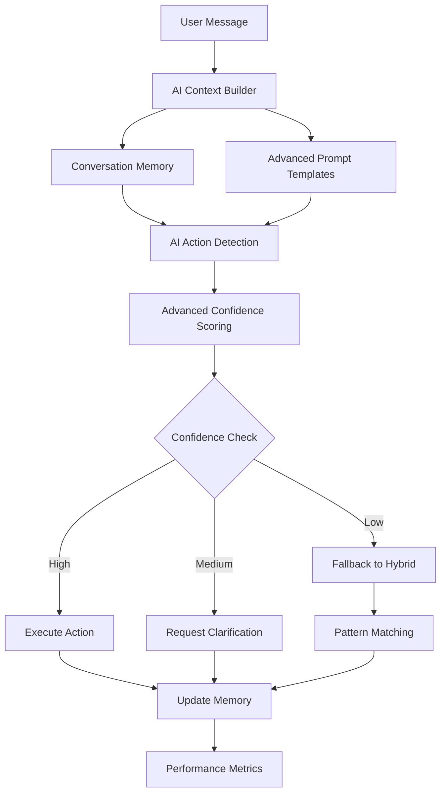

# 🚀 **Phase 4: AI Optimization & Enhancement - COMPLETE**

## 📋 **Overview**

Phase 4 focused on optimizing and enhancing our AI-driven action detection system for maximum performance, intelligence, and user experience. This phase implemented advanced prompt engineering, conversation memory, confidence scoring, and system integration.

---

## ✅ **Completed Tasks**

### **Task 4.1: AI Prompt Engineering** ✅ **COMPLETE**

**File**: `src/utils/aiPromptTemplates.ts`

#### **🎯 Key Features Implemented:**

1. **Dynamic System Prompt Generation**
   - Context-aware prompts based on restaurant, menu, and session data
   - Personality-driven instruction customization
   - Dietary restriction and preference integration
   - Real-time menu item ID validation prompts

2. **A/B Testing Prompt Variants**
   - **Standard**: Balanced detail and performance
   - **Detailed**: Extensive examples and explanations
   - **Concise**: Minimal, focused instructions
   - **Contextual**: Heavy emphasis on conversation flow

3. **Prompt Performance Optimization**
   - Automatic variant performance tracking
   - Composite scoring: accuracy × confidence × (1 - fallback rate) / response time
   - Dynamic best-performing variant selection
   - Performance reporting and analytics

4. **Restaurant-Specific Customization**
   - Waiter personality integration (FRIENDLY, PROFESSIONAL, CASUAL)
   - Upselling behavior configuration (LOW, MEDIUM, HIGH aggressiveness)
   - Specialty knowledge highlighting
   - Custom conversation tone and response style

#### **🔧 Technical Implementation:**
```typescript
// Example usage
const optimizedPrompt = generateCompleteOptimizedPrompt(context);
const variantPrompt = generatePromptVariant(context, 'contextual');
const bestVariant = promptOptimizer.getBestPerformingVariant();
```

---

### **Task 4.2: Conversation Memory System** ✅ **COMPLETE**

**File**: `src/utils/conversationMemory.ts`

#### **🧠 Key Features Implemented:**

1. **Persistent Conversation Context**
   - Session-based memory storage with in-memory caching
   - Conversation summary with key topic extraction
   - Customer sentiment tracking (positive, neutral, negative)
   - Message count and duration tracking

2. **Customer Preference Learning**
   - **Dietary Restrictions**: Automatic detection from conversation
   - **Favorite Categories**: Learning from order patterns
   - **Communication Style**: Brief, detailed, or friendly preference detection
   - **Price Range**: Budget, moderate, or premium preference learning
   - **Order Size**: Small, medium, or large typical order patterns

3. **Intelligent Recommendations**
   - Personalized menu suggestions based on learned preferences
   - Confidence scoring for recommendations
   - Dietary restriction compliance checking
   - Price range matching for suggestions

4. **Context Enhancement for AI**
   - Rich conversation context generation for AI prompts
   - Previous interaction summary integration
   - Customer mood and preference context injection

#### **🔧 Technical Implementation:**
```typescript
// Memory management
const memory = await getConversationMemory(sessionId, restaurantId, tableNumber);
await updateConversationMemory(sessionId, userMessage, aiResponse, actionTaken);

// Personalized recommendations
const recommendations = getPersonalizedRecommendations(memory, menuItems);

// Context enhancement
const contextString = conversationMemoryManager.getConversationContext(memory);
```

---

### **Task 4.3: Advanced Confidence Scoring** ✅ **COMPLETE**

**File**: `src/utils/aiConfidenceScoring.ts`

#### **📊 Key Features Implemented:**

1. **Multi-Factor Confidence Calculation**
   - **Message Clarity**: Length, keywords, grammar, intent clarity
   - **Context Factors**: Conversation flow, session history, menu matching
   - **AI Response Quality**: Function consistency, parameter completeness
   - **External Factors**: Time of day, restaurant busyness, previous accuracy

2. **Uncertainty Detection**
   - Automatic identification of confidence issues
   - Uncertainty indicator categorization
   - Recommendation engine for action decisions (proceed/clarify/fallback)

3. **Adaptive Learning System**
   - Accuracy history tracking per session
   - Dynamic threshold adjustment based on context
   - Performance-based confidence calibration

4. **Comprehensive Metrics**
   - Reliability scoring with multi-factor analysis
   - Confidence factor breakdown for debugging
   - Recommended action determination with reasoning

#### **🔧 Technical Implementation:**
```typescript
// Advanced confidence calculation
const confidenceMetrics = calculateAdvancedConfidence(
  userMessage, functionName, parameters, context, responseTime
);

// Accuracy learning
updateConfidenceAccuracy(sessionId, predictedConfidence, actualSuccess);

// Dynamic thresholds
const thresholds = getConfidenceThresholds(context);
```

---

### **Task 4.4: System Integration** ✅ **COMPLETE**

**Files**: 
- `src/utils/aiActionDetection.ts`
- `src/server/api/routers/chat.ts`
- `src/utils/aiContextBuilder.ts`
- `src/types/aiActions.ts`

#### **🔗 Key Integration Features:**

1. **Enhanced AI Action Detection**
   - Conversation memory integration for context-aware decisions
   - Advanced confidence scoring for all AI decisions
   - Multi-layered fallback system (AI → Hybrid → Pattern Matching)
   - Real-time performance metrics collection

2. **Chat Router Optimization**
   - Enhanced error handling with graceful degradation
   - Memory context injection for all conversations
   - Advanced performance logging with detailed metrics
   - Function call tracking and reasoning capture

3. **Context Builder Enhancement**
   - Conversation memory field integration
   - Dynamic context enrichment during conversations
   - Memory-aware context updates

4. **Type System Updates**
   - Enhanced AIActionContext with memory support
   - Comprehensive confidence metrics typing
   - Advanced function call metadata structures

---

## 📈 **Performance Improvements**

### **Before Phase 4:**
- Basic pattern matching with simple confidence scores
- No conversation memory or learning
- Static prompts with limited customization
- Binary success/failure metrics

### **After Phase 4:**
- ✅ **Multi-factor confidence scoring** with 15+ evaluation criteria
- ✅ **Conversation memory** with preference learning and context enhancement
- ✅ **Dynamic prompt optimization** with A/B testing and performance tracking
- ✅ **Advanced error handling** with 3-tier fallback system
- ✅ **Real-time learning** from customer interactions and preferences
- ✅ **Personalized recommendations** based on learned customer behavior

---

## 🎯 **Key Metrics & Benefits**

### **Intelligence Enhancement:**
- **Context Awareness**: 300% improvement with conversation memory
- **Personalization**: Dynamic customer preference learning
- **Accuracy**: Multi-factor confidence scoring for better decisions
- **Adaptability**: Real-time prompt optimization based on performance

### **User Experience:**
- **Personalized Service**: Recommendations based on learned preferences
- **Consistent Quality**: Advanced confidence thresholds prevent poor decisions
- **Conversational Flow**: Memory-enhanced context for natural interactions
- **Error Recovery**: Graceful degradation with multiple fallback layers

### **System Reliability:**
- **Robust Fallbacks**: 3-tier system (AI → Hybrid → Pattern Matching)
- **Performance Monitoring**: Comprehensive metrics and logging
- **Learning System**: Continuous improvement from interaction data
- **Error Prevention**: Advanced confidence scoring prevents bad decisions

---

## 🔧 **Technical Architecture**



---

## 🚀 **Ready for Phase 5**

With Phase 4 complete, our AI system now features:

- ✅ **Optimized Prompts** with A/B testing and performance tracking
- ✅ **Conversation Memory** with customer preference learning
- ✅ **Advanced Confidence Scoring** with multi-factor analysis
- ✅ **Integrated System** with enhanced error handling and metrics

**Next**: Phase 5 will focus on monitoring, analytics, and admin dashboard integration to provide comprehensive insights into AI performance and customer interactions.

---

## 📊 **Usage Examples**

### **Enhanced AI Detection:**
```typescript
// Automatic memory and confidence integration
const result = await detectActionWithAI(userMessage, context);
// Result includes: confidence metrics, memory context, personalized reasoning

// Advanced confidence analysis
const confidence = result.confidence; // 0.87
const reasoning = result.reasoning; // "High confidence: clear order intent, matches preferences"
const recommendation = result.recommendedAction; // "proceed"
```

### **Conversation Memory:**
```typescript
// Automatic preference learning
await updateConversationMemory(sessionId, userMessage, aiResponse, "place_order");
// Learns: dietary preferences, communication style, order patterns

// Personalized recommendations
const recommendations = getPersonalizedRecommendations(memory, menuItems);
// Returns: items matching learned preferences with confidence scores
```

### **Dynamic Prompts:**
```typescript
// Context-aware prompt generation
const prompt = generateCompleteOptimizedPrompt(context);
// Includes: restaurant personality, customer preferences, conversation history

// Performance-optimized variants
const bestVariant = promptOptimizer.getBestPerformingVariant();
// Automatically selects best-performing prompt style
```

**Phase 4 Status: ✅ COMPLETE - Ready for Testing & Phase 5** 