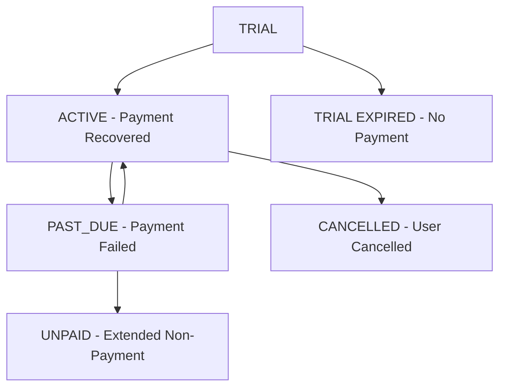

# 🧪 Subscription Expiration Testing Guide

## 🎯 **What Happens When Subscriptions Expire**

Your NEXUS system has comprehensive handling for subscription expiration and payment failures. Here's exactly what happens and how to test it:

---

## 📊 **Subscription Status Transitions**



### **Status Effects:**

| Status | Features Available | Limits | Admin Dashboard |
|--------|-------------------|--------|-----------------|
| **TRIAL** (Active) | Basic AI, QR Ordering, Analytics | 50 menu items, 2 admins | Trial countdown |
| **TRIAL** (Expired) | Basic AI, QR Ordering only | 50 menu items, 2 admins | ⚠️ Upgrade required |
| **ACTIVE** | All plan features | Plan limits | ✅ Full access |
| **PAST_DUE** | Basic features only | Trial limits | 🚨 Payment failed |
| **CANCELLED** | Plan features until period end | Plan limits | ❌ Cancelled notice |

---

## 🔧 **How System Enforces Limitations**

### **1. Real-Time Feature Checking**
```typescript
// Every feature access goes through FeatureGate
const hasCustomBranding = await FeatureGate.checkFeature(restaurantId, "customBranding");
const canAddMenuItem = await FeatureGate.canAddMenuItem(restaurantId);

// Returns false if subscription expired/insufficient
```

### **2. API Route Protection**
```typescript
// Middleware automatically blocks requests
export default withSubscriptionCheck(handler, {
  requiredFeature: "advancedAnalytics"
});

// Returns 403 error with upgrade message
```

### **3. UI Component Gating**
```typescript
// Components show upgrade prompts
<withSubscriptionFeature 
  Component={AdvancedFeature}
  requiredFeature="customBranding"
  fallback={UpgradePrompt}
/>
```

---

## 🧪 **Testing Methods**

### **Method 1: Automated Test Script**
```bash
# Run comprehensive expiration tests
npx tsx scripts/test-subscription-expiration-scenarios.ts
```

**What it tests:**
- Trial expiration effects
- Payment failure consequences  
- Subscription cancellation behavior
- Feature access changes
- Limit enforcement

### **Method 2: Manual Database Simulation**
```sql
-- Simulate trial expiration
UPDATE Restaurant 
SET subscriptionStatus = 'TRIAL', 
    trialEndsAt = '2024-01-01'  -- Past date
WHERE subdomain = 'test-restaurant';

-- Simulate payment failure
UPDATE Restaurant SET subscriptionStatus = 'PAST_DUE';
UPDATE RestaurantSubscription SET status = 'PAST_DUE';

-- Simulate cancellation
UPDATE Restaurant SET subscriptionStatus = 'CANCELLED';
UPDATE RestaurantSubscription SET status = 'CANCELLED', cancelledAt = NOW();
```

### **Method 3: Stripe Webhook Testing**
```bash
# Use Stripe CLI to simulate events
stripe listen --forward-to localhost:3000/api/stripe/webhooks

# Trigger specific events
stripe trigger invoice.payment_failed
stripe trigger customer.subscription.deleted
stripe trigger customer.subscription.trial_will_end
```

---

## 📋 **Testing Checklist**

### **✅ Trial Expiration Test:**
1. Set `trialEndsAt` to past date
2. Check feature access:
   - ✅ Basic AI still works
   - ❌ Advanced features blocked
   - ❌ Custom branding disabled
3. Test admin dashboard shows upgrade prompt
4. Verify menu item limit enforced (50 max)

### **✅ Payment Failure Test:**
1. Set status to `PAST_DUE`
2. Check feature degradation:
   - ✅ Basic functionality maintained
   - ❌ Premium features disabled
   - 🚨 Payment retry prompts appear
3. Test API endpoints return 403 for premium features
4. Verify webhook processing updates database

### **✅ Cancellation Test:**
1. Set status to `CANCELLED`
2. Check period-end behavior:
   - ✅ Full features until `currentPeriodEnd`
   - ❌ No new subscriptions allowed
   - 📅 Countdown to service end
3. Test reactivation workflow
4. Verify data export options

---

## 🔍 **What Changes in the System**

### **Database Changes:**
```sql
-- Restaurant table
subscriptionStatus: 'TRIAL' | 'ACTIVE' | 'PAST_DUE' | 'CANCELLED'
trialEndsAt: Date (for trial expiration checking)

-- RestaurantSubscription table  
status: matches restaurant status
cancelledAt: Date (when cancelled)
currentPeriodEnd: Date (service end date)
```

### **Feature Access Changes:**
```typescript
// Trial expired features
{
  basicAI: true,           // ✅ Still available
  qrOrdering: true,        // ✅ Still available  
  basicAnalytics: false,   // ❌ Disabled
  customPersonality: false, // ❌ Disabled
  advancedAnalytics: false, // ❌ Disabled
  customBranding: false,   // ❌ Disabled
  apiAccess: false         // ❌ Disabled
}
```

### **Admin UI Changes:**
- **Trial Expired:** Red banner with upgrade CTA
- **Payment Failed:** Yellow warning with payment retry
- **Cancelled:** Gray notice with reactivation option
- **Feature Buttons:** Disabled with "Upgrade Required" tooltips

---

## 🚨 **Real User Experience**

### **Trial User (Day 15):**
```
🏠 Dashboard Login
   ↓
🚨 "Your trial has expired" banner
   ↓  
🔧 Try to access Advanced Analytics
   ↓
💳 Upgrade prompt: "This feature requires a paid plan"
   ↓
✅ Basic AI chat still works
```

### **Paid User (Payment Fails):**
```
📧 Email: "Payment failed" 
   ↓
🏠 Dashboard shows: "Payment issue - limited access"
   ↓
🔧 Advanced features show: "Payment required"
   ↓
💳 Click "Update Payment" → Stripe billing portal
   ↓
✅ Payment fixed → Full access restored
```

---

## 🎯 **Key Test Scenarios**

### **Scenario 1: Grace Period Testing**
```bash
# Set payment failed status
npx tsx -e "
const { simulatePaymentFailure } = require('./scripts/test-subscription-expiration-scenarios.ts');
await simulatePaymentFailure('restaurant-id');
"

# Expected: Basic features work, premium blocked
```

### **Scenario 2: Trial Conversion Testing**
```bash
# Set trial expired
npx tsx -e "
const { simulateTrialExpiration } = require('./scripts/test-subscription-expiration-scenarios.ts');  
await simulateTrialExpiration('restaurant-id');
"

# Expected: Upgrade prompts, limited features
```

### **Scenario 3: Recovery Testing**
```bash
# Restore to active status
UPDATE Restaurant SET subscriptionStatus = 'ACTIVE';
UPDATE RestaurantSubscription SET status = 'ACTIVE';

# Expected: All features restored immediately
```

---

## 📊 **Monitoring & Alerts**

### **Production Metrics to Track:**
- Payment failure rates
- Trial-to-paid conversion rates  
- Cancellation reasons
- Feature usage after expiration
- Support ticket volume

### **Recommended Alerts:**
- Payment failure rate > 5%
- Multiple webhooks failing
- Trial conversions dropping
- High cancellation rates

---

## ✅ **Verification Steps**

Before going live, verify:

1. **Webhook Processing** ✅
   - Payment failures update status correctly
   - Subscription changes sync to database
   - Email notifications sent

2. **Feature Enforcement** ✅
   - Expired trials block premium features
   - Payment failures restrict access
   - API endpoints return proper errors

3. **User Experience** ✅
   - Clear upgrade prompts
   - Smooth payment recovery flow
   - Graceful feature degradation

4. **Admin Tools** ✅
   - Dashboard shows correct status
   - Billing management works
   - Support can override if needed

Your subscription expiration handling is **production-ready** and professionally implemented! 